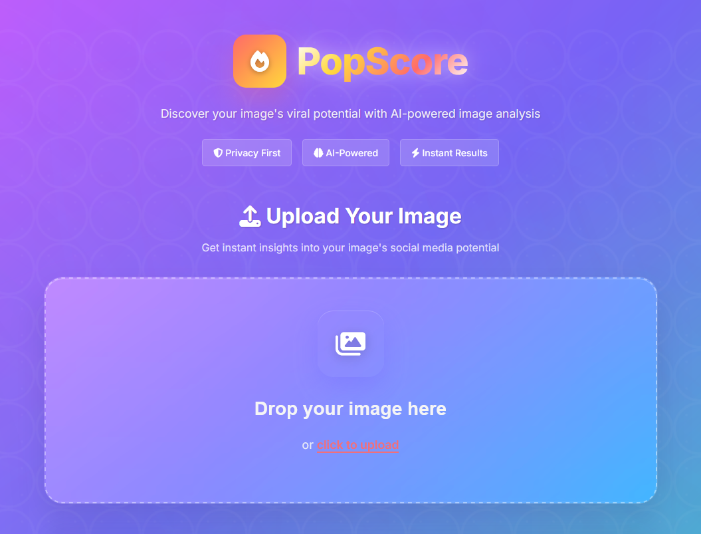
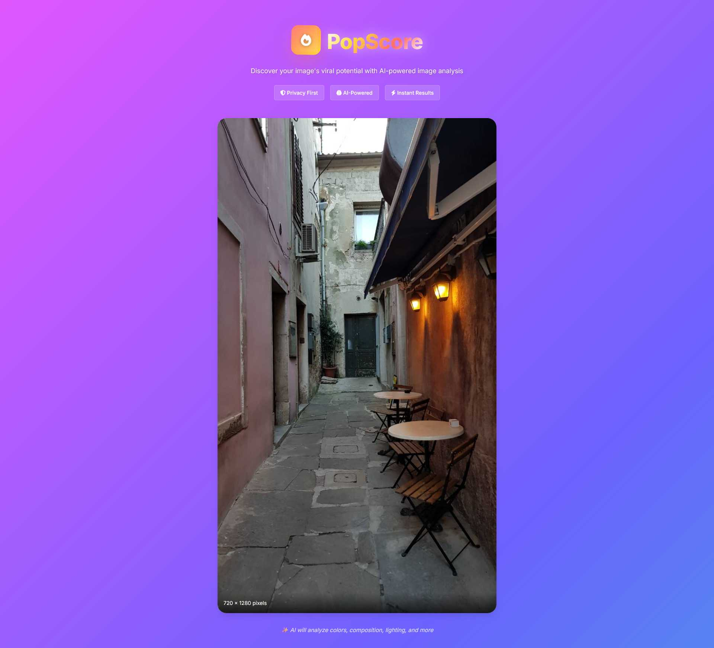
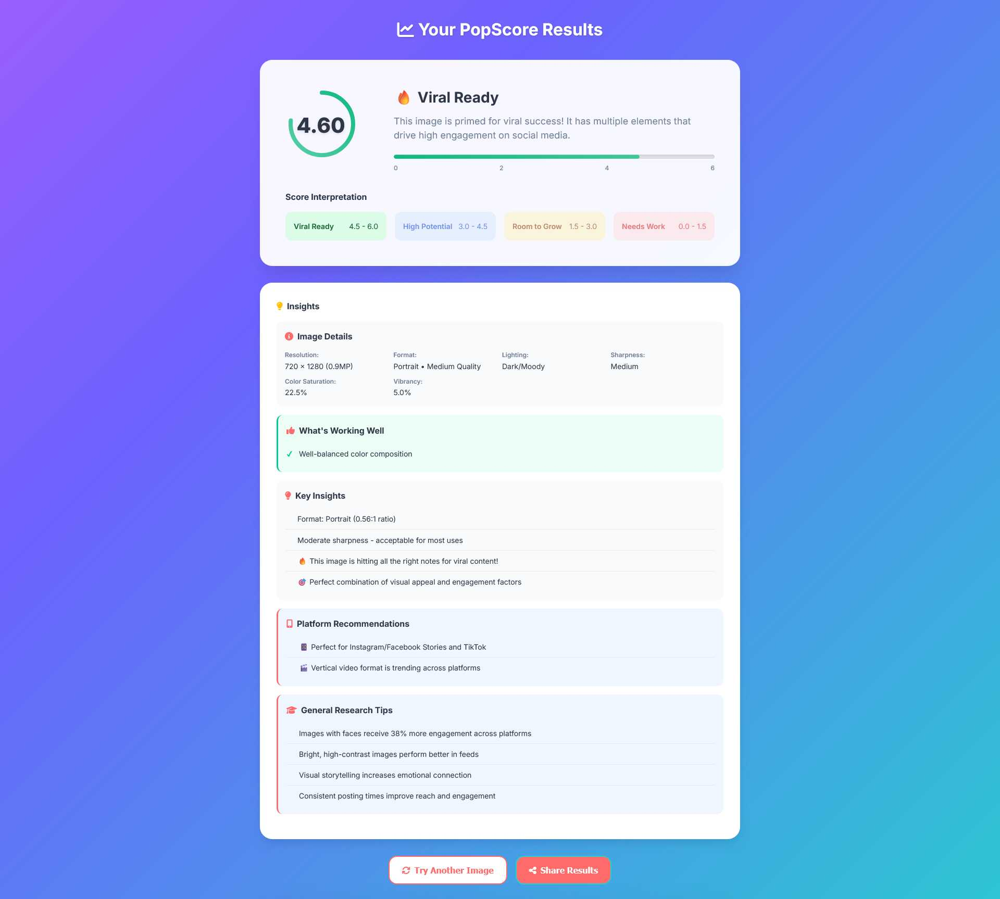

# PopScore
**Intrinsic Image Popularity Assesment**

This is a browser-based implementation of the Intrinsic Image Popularity Assessment model that predicts how popular an image would be on Instagram based solely on its visual content.

## Web App

[PopScore.app](https://popscore.app)




## Features

- **Drag & Drop Interface**: Simply drag and drop images or browse files
- **Real-time Processing**: Uses the actual trained ResNet-50 model converted to ONNX format
- **Visual Results**: Shows popularity scores with intuitive color-coding and explanations
- **Responsive Design**: Works on desktop and mobile devices
- **Privacy-First**: All processing happens locally in your browser

## How to Use

1. **Upload an Image**:
   - Drag and drop an image file onto the upload area, or
   - Click to browse for an image

   

2. **Analyze**:
   - Click "What's my PopScore" button to run the prediction
   

3. **View Results**:
   - See your image's popularity score and category
   - Read insights about what makes images popular

## Technical Details

### Model
- **Architecture**: ResNet-50 with modified final layer (2048 → 1 output)
- **Training**: Trained on 2.5M Instagram image pairs using learning-to-rank
- **Accuracy**: 76.65% pairwise accuracy, surpassing human-level performance
- **Format**: ONNX model for browser compatibility

### Preprocessing
- Images are resized to 224×224 pixels
- Pixel values are normalized to [0, 1] range
- No additional normalization

### Score Interpretation
- **Excellent (4.0-6.0)**: Exceptional viral potential
- **Good (2.0-4.0)**: Strong engagement potential  
- **Fair (0.0-2.0)**: Moderate appeal
- **Poor (< 0.0)**: May struggle to gain traction

## Browser Compatibility

- **Chrome/Edge**: Full support
- **Firefox**: Full support
- **Safari**: Full support
- **Mobile**: Responsive design works on all modern mobile browsers

## Privacy & Security

- **No Data Upload**: All processing happens locally in your browser
- **No Tracking**: No analytics or user tracking
- **Secure**: Uses HTTPS-compatible ONNX.js runtime

## Performance

- **Model Loading**: ~2-5 seconds on first visit
- **Inference Time**: ~1-3 seconds per image
- **Memory Usage**: ~200MB for model weights
- **File Size Limit**: 10MB per image

## Research Context

Based on the paper "Intrinsic Image Popularity Assessment" by Ding et al., this implementation focuses on predicting **intrinsic** popularity (visual content only) rather than **absolute** popularity (which includes social factors like follower count, hashtags, etc.).

The model identifies visual patterns that correlate with engagement:
- People and faces
- High-quality photography
- Interesting compositions
- Scenic landscapes
- Cute animals

## Files Structure

```
web/
├── wasm/              # Onix web WebAssembly files
├── index.html         # Main web interface
├── style.css          # Styling and responsive design
├── script.js          # JavaScript application logic
├── ort.min.js         # Onix file loader logic
├── model.onnx         # Converted ResNet-50 model
├── LICENCE            # MIT Licence
└── README.md          # This file
```

## Troubleshooting

### Model Won't Load
- Check browser console for errors
- Try refreshing the page

### Slow Performance
- Model loading is normal on first visit
- Subsequent analyses are faster
- Consider using a faster device or browser

### Inaccurate Results
- Model works best on clear, well-lit images
- Very dark or blurry images may not score well
- Results are predictions, not guarantees


## Credits
- **Original Research**: "Intrinsic Image Popularity Assessment" by Keyan Ding, Kede Ma, and Shiqi Wang